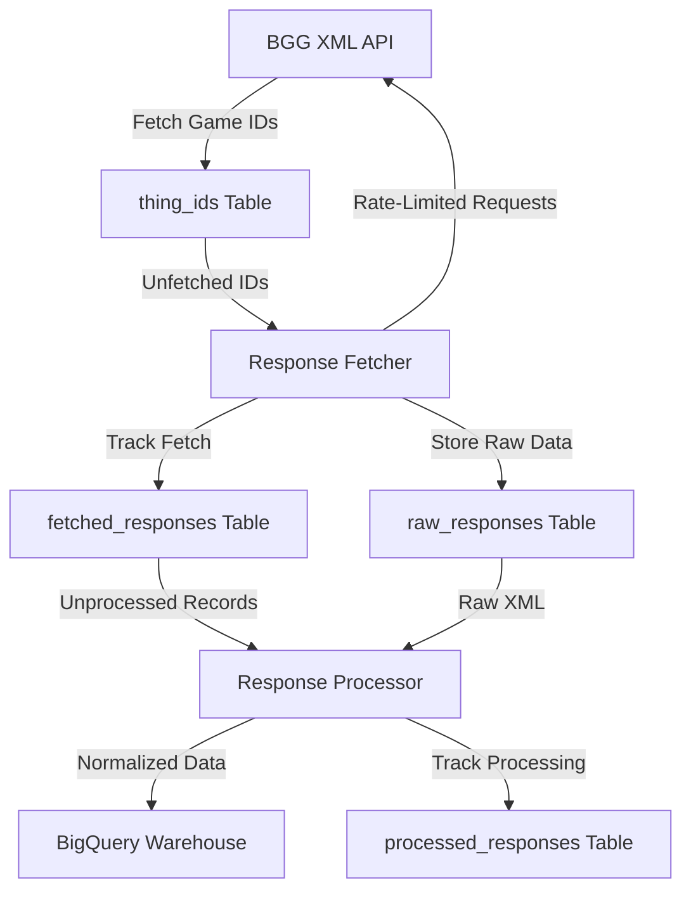

# BGG Data Warehouse

A data pipeline for collecting, processing, and analyzing BoardGameGeek game data using BigQuery.

## Overview

This project collects board game data from BoardGameGeek's API, stores raw responses in BigQuery, and processes them into a normalized data warehouse for analysis.

## Architecture

### Pipeline Components

**Fetch New Games** (`src/pipeline/fetch_new_games.py`)
- Retrieves new board game IDs from BoardGameGeek
- Fetches API responses for unfetched games
- Processes responses into normalized tables
- Runs daily at 6 AM UTC

**Refresh Old Games** (`src/pipeline/refresh_old_games.py`)
- Refreshes stale game data based on publication year
- Recent games (0-2 years): refreshed weekly
- Established games (2-5 years): refreshed monthly
- Classic games (5-10 years): refreshed quarterly
- Vintage games (10+ years): refreshed bi-annually
- Runs daily at 7 AM UTC

### Data Flow



### BigQuery Datasets

**Raw Dataset** (`raw`)
- `thing_ids`: Game ID registry
- `raw_responses`: Raw API responses
- `fetched_responses`: Fetch tracking
- `processed_responses`: Processing tracking
- `request_log`: API request audit log
- `fetch_in_progress`: Prevents duplicate concurrent fetches

**Core Dataset** (`core`)
- `games`: Core game data
- `categories`, `mechanics`, `families`: Dimension tables
- `designers`, `artists`, `publishers`: Creator tables
- `rankings`, `player_counts`: Metrics tables

**Analytics Dataset** (`analytics`) - Managed by Dataform
- `games_active`: View of latest game data (deduped by game_id)
- `games_features`: Denormalized table with computed columns:
  - `hurdle`: Binary flag for games with 25+ ratings
  - `geek_rating`, `complexity`, `rating`: Renamed metrics
  - `log_users_rated`: Log-transformed user count
  - Aggregated arrays for categories, mechanics, publishers, designers, artists, families

### Infrastructure

All infrastructure is managed via Terraform in the `terraform/` directory.

- **Cloud Run Jobs**: Two jobs execute the pipelines daily
  - `bgg-fetch-new-games`: 1 vCPU, 2GB memory
  - `bgg-refresh-old-games`: 1 vCPU, 2GB memory
- **Dataform**: Analytics transformations run via GitHub Actions workflow
- **GitHub Actions**: Triggers Cloud Run jobs on schedule, deploys on merge to main, runs Dataform
- **Cloud Build**: Builds and deploys Docker images

## Prerequisites

- Python 3.12+
- UV package manager
- Google Cloud project with:
  - Cloud Run API
  - Cloud Build API
  - BigQuery API
- Service account with BigQuery Data Editor, Cloud Run Invoker roles

## Setup

1. Clone the repository:
```bash
git clone https://github.com/phenrickson/bgg-data-warehouse.git
cd bgg-data-warehouse
```

2. Install UV and dependencies:
```bash
# Install UV (see https://docs.astral.sh/uv/getting-started/installation/)
curl -LsSf https://astral.sh/uv/install.sh | sh

# Create virtual environment and install dependencies
uv venv
source .venv/bin/activate  # Unix/macOS
.venv\Scripts\activate     # Windows
uv sync
```

3. Configure environment:
```bash
cp .env.example .env
# Edit .env with your GCP_PROJECT_ID, ENVIRONMENT, BGG_API_TOKEN
```

4. Configure GitHub repository secrets:
- `SERVICE_ACCOUNT_KEY`: GCP service account key JSON
- `GCP_PROJECT_ID`: Google Cloud project ID
- `BGG_API_TOKEN`: BoardGameGeek API token

## Usage

### Local Development

```bash
# Fetch new games
uv run python -m src.pipeline.fetch_new_games

# Refresh old games
uv run python -m src.pipeline.refresh_old_games

# Run tests
uv run pytest
```

### Manual Job Execution

```bash
gcloud run jobs execute bgg-fetch-new-games-prod --region us-central1 --wait
gcloud run jobs execute bgg-refresh-old-games-prod --region us-central1 --wait
```

## Dashboard

A Streamlit dashboard is available for exploring the data:

```bash
streamlit run src/visualization/dashboard.py
```

The dashboard is also deployed to Cloud Run and accessible via the URL output by the deploy workflow.

## Versioning

This project uses semantic versioning. When changes are merged to main with a version bump in `pyproject.toml`, a GitHub Action automatically creates a corresponding git tag.

See [CHANGELOG.md](CHANGELOG.md) for version history.

## License

MIT License
