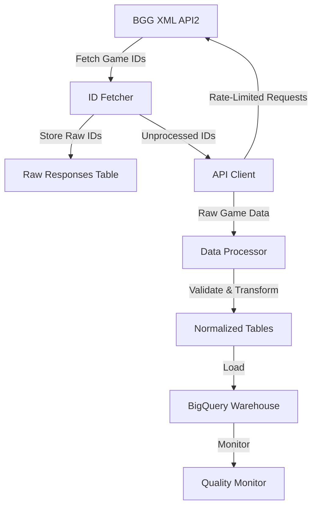

# BGG Data Warehouse

A sophisticated data pipeline for collecting, processing, and analyzing BoardGameGeek game data.

## Overview

The BGG Data Pipeline is strategically designed to efficiently collect, process, and analyze board game data from BoardGameGeek, with a robust architecture that ensures data integrity and performance.

### Recent Improvements

- **Enhanced Response Handling**
  - Intelligent processing of game IDs with no response
  - Graceful handling of empty or problematic API responses
  - Detailed logging and status tracking for API interactions
  - Improved error handling and data integrity checks

### Components

#### Response Fetcher (`src/pipeline/fetch_responses.py`)
- Continuously fetches game data from the BGG API
- Stores raw XML responses in BigQuery's `raw_responses` table
- Advanced error handling for various API response scenarios
- Handles API rate limiting and retries
- Runs as a local process
- Fetches games in chunks (default 20 games per API call)
- Tracks processing status and timestamps
- Automatically marks game IDs with no response or parsing errors

#### Response Processor (`src/pipeline/process_responses.py`)
- Processes raw responses into normalized tables
- Robust handling of incomplete or problematic game data
- Runs as a Cloud Run Job
- Supports multiple parallel tasks (default 5 concurrent processing jobs)
- Handles processing errors without disrupting overall data fetching
- Automatically retries failed processing attempts
- Scheduled to run every 10 minutes
- Enhanced logging and status tracking

### Data Flow Diagram



### Key Features
- Automated BGG game data collection
- Intelligent rate-limited API client
- Comprehensive data validation
- BigQuery data warehouse integration
- Robust error handling and retry mechanisms
- Advanced tracking of API response processing
- Data quality monitoring
- Raw data archival to Cloud Storage

## Prerequisites

- Python 3.12+
- Google Cloud project with required APIs enabled:
  - Cloud Run
  - Cloud Build
  - Cloud Scheduler
  - BigQuery
  - Container Registry
- Service account with necessary permissions
- `uv` package manager

## Setup

1. Clone the repository:
```bash
git clone https://github.com/yourusername/bgg-data-warehouse.git
cd bgg-data-warehouse
```

2. Create service account and grant permissions:
```bash
# Create service account
gcloud iam service-accounts create bgg-processor \
  --display-name="BGG Processor Service Account"

# Grant required permissions
gcloud projects add-iam-policy-binding $PROJECT_ID \
  --member="serviceAccount:bgg-processor@$PROJECT_ID.iam.gserviceaccount.com" \
  --role="roles/bigquery.dataEditor"
```

3. Install dependencies:
```bash
make install
```

4. Configure Google Cloud credentials:
```bash
export GOOGLE_APPLICATION_CREDENTIALS="path/to/service-account-key.json"
```

## Usage

### Fetching Data

To fetch new board game data:
```bash
# Run in development
uv run python -m src.pipeline.fetch_responses --environment=dev

# Run in production
uv run python -m src.pipeline.fetch_responses --environment=prod
```

### Processing Data

To process raw responses:
```bash
# Run in development
uv run python -m src.pipeline.process_responses --environment=dev

# Run in production
uv run python -m src.pipeline.process_responses --environment=prod
```

## Monitoring

### BigQuery Views

Monitoring views are automatically created:

```sql
-- Processing status view
CREATE VIEW `monitoring.processing_status` AS
SELECT
  COUNT(*) as total_responses,
  COUNTIF(processed) as processed_count,
  COUNTIF(NOT processed) as unprocessed_count,
  COUNTIF(process_status IS NOT NULL) as error_count
FROM `raw.raw_responses`
WHERE fetch_timestamp > TIMESTAMP_SUB(CURRENT_TIMESTAMP(), INTERVAL 24 HOUR);

-- Processing errors view
CREATE VIEW `monitoring.processing_errors` AS
SELECT
  game_id,
  process_attempt,
  process_status as error,
  fetch_timestamp,
  process_timestamp
FROM `raw.raw_responses`
WHERE NOT processed
AND process_status IS NOT NULL
ORDER BY process_timestamp DESC;
```

### Error Handling

1. API Errors:
   - Fetcher retries with exponential backoff
   - Failed requests logged in `request_log` table
   - Automatic marking of game IDs with no response

2. Processing Errors:
   - Each response can be retried up to 3 times
   - Errors stored in `process_status` field
   - Failed items do not block other processing
   - Detailed logging of processing challenges

## Development

### Local Testing

1. Test fetcher:
```bash
uv run python -m src.pipeline.fetch_responses --environment=dev
```

2. Test processor:
```bash
uv run python -m src.pipeline.process_responses --environment=dev
```

### Adding New Features

1. Modify processor:
   - Update `process_responses.py`
   - Build and test locally
   - Deploy new version:
     ```bash
     gcloud builds submit
     ```

2. Modify fetcher:
   - Update `fetch_responses.py`
   - Deploy new version to fetcher instance

## Contributing

1. Fork the repository
2. Create a feature branch
3. Make your changes
4. Run tests and linting
5. Submit a pull request

## License

MIT License - see LICENSE file for details.
