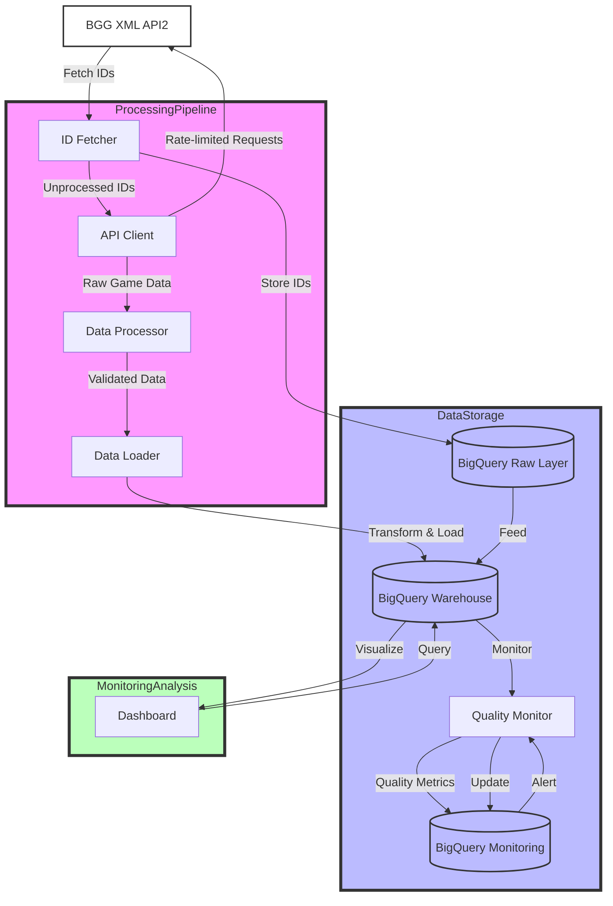

# BGG Data Warehouse

A data pipeline for loading BoardGameGeek data into BigQuery.

## Overview

This project fetches board game data from the BoardGameGeek XML API2 and loads it into a BigQuery data warehouse. It includes:



The pipeline includes:

- Automated ID collection from BGG
- Rate-limited API client respecting BGG's terms of service
- Data validation and transformation
- BigQuery loading with data versioning
- Data quality monitoring
- Raw data archival to Google Cloud Storage

## Prerequisites

- Python 3.12+
- Google Cloud project with BigQuery and Cloud Storage enabled
- Service account with necessary permissions
- `uv` package manager

## Setup

1. Clone the repository:
```bash
git clone https://github.com/yourusername/bgg-data-warehouse.git
cd bgg-data-warehouse
```

2. Create a virtual environment and install dependencies:
```bash
make install
```

3. Configure your Google Cloud credentials:
```bash
# Set up service account key
export GOOGLE_APPLICATION_CREDENTIALS="path/to/your/service-account-key.json"
```

4. Update configuration:
   - Edit `config/bigquery.yaml` with your project details
   - Set environment variables in `.env`:
     ```
     GCP_PROJECT_ID=your-project-id
     GCS_BUCKET=your-bucket-name
     ```

5. Create BigQuery datasets and tables:
```bash
make create-datasets
```

## Usage

### Fetching Data

To fetch new board game data:
```bash
make fetch
```

This will:
1. Download the latest game IDs from BGG
2. Process any unprocessed games
3. Load the data into BigQuery
4. Archive raw data to Cloud Storage

### Utility Scripts

The project includes several utility scripts for data management and analysis:

```bash
# Examine details of a specific game
make examine-game GAME=1234

# Check for duplicate game entries in the warehouse
make check-duplicates
```

### Loading Data

The project supports multiple ways to load game data into BigQuery:

```bash
# Load all unprocessed games
make load

# Explicitly load all unprocessed games
make load-unprocessed

# Load specific games by ID
make load-games GAMES='1234 5678 9012'
```

The loading process:
1. Fetches game data from the BGG API
2. Processes and validates the data
3. Loads into BigQuery tables
4. Updates processing status for tracking

### Updating Data

To update existing data:
```bash
make update
```

### Quality Checks

To run data quality checks:
```bash
make quality
```

### Visualization Dashboard

To run the visualization dashboard:
```bash
make dashboard
```

This will start a Streamlit server at http://localhost:8501 with the following features:
- Top rated games visualization
- Games published by year
- Popular game mechanics analysis
- Data quality metrics

Using Docker Compose:
```bash
# Start all services including the dashboard
docker-compose up -d

# Start only the dashboard
docker-compose up -d dashboard

# View dashboard logs
docker-compose logs -f dashboard
```

The dashboard will be available at http://localhost:8501.

### Development

Run all tests:
```bash
make test
```

Run linting:
```bash
make lint
```

Clean temporary files:
```bash
make clean
```

## Project Structure

```
bgg-data-warehouse/
├── Makefile              # Task automation
├── README.md            # Project documentation
├── config/              # Configuration files
│   └── bigquery.yaml   # BigQuery configuration
├── src/                 # Source code
│   ├── api_client/     # BGG API client
│   ├── data_processor/ # Data transformation
│   ├── id_fetcher/     # Game ID management
│   ├── pipeline/       # Main pipeline logic
│   ├── quality_monitor/# Data quality checks
│   ├── visualization/  # Data visualization
│   └── warehouse/      # BigQuery integration
├── tests/              # Test suite
└── src/scripts/        # Utility scripts for data management and analysis
```

## Data Model

### Raw Layer
- `bgg_raw.games` - Raw game data
- `bgg_raw.request_log` - API request tracking
- `bgg_raw.thing_ids` - Game IDs mapping with processing status

### Transformed Layer
- `bgg_transformed.dim_games` - Game dimensions
- `bgg_transformed.dim_categories` - Category dimensions
- `bgg_transformed.dim_mechanics` - Mechanics dimensions
- `bgg_transformed.fact_ratings` - Rating facts
- `bgg_transformed.fact_weights` - Weight facts

### Reporting Layer
- `bgg_reporting.game_metrics` - Aggregated metrics
- `bgg_reporting.trending` - Time-based trends
- `bgg_reporting.rankings` - Current rankings

## Monitoring

Data quality is monitored through several checks:
- Completeness: Required fields presence
- Freshness: Data update frequency
- Validity: Value range checks
- API Performance: Request success rates and timing

Results are stored in `bgg_monitoring.data_quality`.

## Contributing

1. Fork the repository
2. Create a feature branch
3. Make your changes
4. Run tests and linting
5. Submit a pull request

## License

MIT License - see LICENSE file for details.
