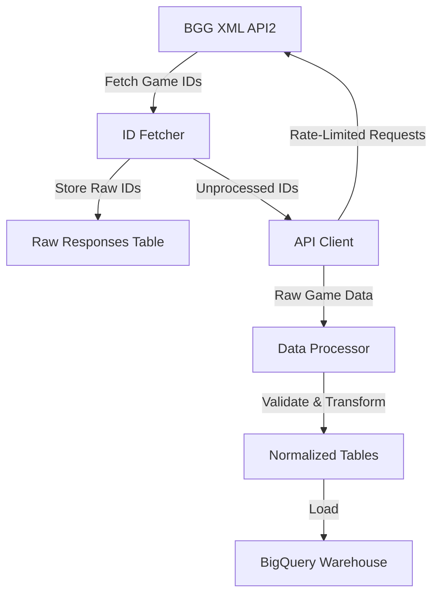

# BGG Data Warehouse

A data pipeline for collecting, processing, and analyzing BoardGameGeek game data.

## Overview

The BGG Data Pipeline is designed to efficiently collect, process, and analyze board game data from BoardGameGeek, with a robust architecture that ensures data integrity and performance.

### Latest Features (v0.2.0)

- **UV Package Manager Integration**
  - Replaced pip with UV for faster, more reliable package management
  - Improved dependency resolution and virtual environment handling
  - Enhanced project setup and development workflow

- **Enhanced Response Handling**
  - Intelligent processing of game IDs with no response
  - Graceful handling of empty or problematic API responses
  - Detailed logging and status tracking for API interactions
  - Improved error handling and data integrity checks

- **Cloud Run Integration**
  - Automated pipeline runs via Cloud Run jobs
  - Streamlined deployment process with Cloud Build
  - Enhanced environment configuration handling
  - Comprehensive GitHub Actions workflows

### Upcoming Features (Unreleased)

- New fetch_in_progress table for tracking and locking game fetches
- Parallel fetching support with distributed locking mechanism
- Automated cleanup of stale in-progress entries after 30 minutes
- Pipeline now runs every 3 hours instead of hourly for better resource utilization

### Components

#### ID Fetcher (`src/pipeline/fetch_ids.py`)
- Retrieves universe of board game IDs from BoardGameGeek
- Stores IDs in BigQuery's `thing_ids` table
- Runs as a Cloud Run job in both prod and dev environments

#### Response Fetcher (`src/pipeline/fetch_responses.py`)
- Continuously fetches game data from the BGG API
- Stores raw XML responses in BigQuery's `raw_responses` table
- Advanced error handling for various API response scenarios
- Handles API rate limiting and retries
- Runs as a Cloud Run job in both prod and dev environments
- Fetches games in chunks (default 20 games per API call)
- Tracks processing status and timestamps
- Automatically marks game IDs with no response or parsing errors

#### Response Processor (`src/pipeline/process_responses.py`)
- Processes raw responses into normalized tables
- Robust handling of incomplete or problematic game data
- Runs as a Cloud Run Job
- Supports multiple parallel tasks (default 5 concurrent processing jobs)
- Handles processing errors without disrupting overall data fetching
- Automatically retries failed processing attempts
- Scheduled to run every 3 hours
- Enhanced logging and status tracking

### Data Flow Diagram



### Key Features
- Automated BGG game data collection
- Intelligent rate-limited API client
- Comprehensive data validation
- BigQuery data warehouse integration
- Robust error handling and retry mechanisms
- Advanced tracking of API response processing
- Raw data archival to Cloud Storage

## Prerequisites

- Python 3.12+
- UV package manager (required, replaces pip)
- Google Cloud project with required APIs enabled:
  - Cloud Run
  - Cloud Build
  - Cloud Scheduler
  - BigQuery
  - Container Registry
- Service account with necessary permissions:
  - Cloud Run Invoker
  - Cloud Build Editor
  - BigQuery Data Editor
- GitHub repository secrets configured:
  - `SERVICE_ACCOUNT_KEY`: GCP service account key JSON
  - `GCP_PROJECT_ID`: Google Cloud project ID
  - `BGG_API_TOKEN`: BoardGameGeek API authentication token
- GitHub repository variables:
  - `ENVIRONMENT`: Deployment environment (e.g., 'prod', 'dev')

## Setup

1. Clone the repository:
```bash
git clone https://github.com/phenrickson/bgg-data-warehouse.git
cd bgg-data-warehouse
```

2. Create service account and grant permissions:
```bash
# Create service account
gcloud iam service-accounts create bgg-processor \
  --display-name="BGG Processor Service Account"

# Grant required permissions
gcloud projects add-iam-policy-binding $PROJECT_ID \
  --member="serviceAccount:bgg-processor@$PROJECT_ID.iam.gserviceaccount.com" \
  --role="roles/bigquery.dataEditor"

gcloud projects add-iam-policy-binding $PROJECT_ID \
  --member="serviceAccount:bgg-processor@$PROJECT_ID.iam.gserviceaccount.com" \
  --role="roles/run.invoker"

gcloud projects add-iam-policy-binding $PROJECT_ID \
  --member="serviceAccount:bgg-processor@$PROJECT_ID.iam.gserviceaccount.com" \
  --role="roles/cloudbuild.builds.editor"
```

3. Install UV package manager:
```bash
# Using winget (Windows)
winget install --id=astral-sh.uv -e

# Using Homebrew (macOS)
brew install uv

# Using the installer script (Linux/macOS)
curl -LsSf https://astral.sh/uv/install.sh | sh
```

4. Install dependencies:
```bash
# Create virtual environment
uv venv

# Activate virtual environment
# On Windows:
.venv\Scripts\activate
# On Unix/macOS:
source .venv/bin/activate

# Install dependencies
uv sync
```

5. Configure Google Cloud credentials:
```bash
export GOOGLE_APPLICATION_CREDENTIALS="path/to/service-account-key.json"
```

6. Configure environment variables:
```bash
# Copy example environment file
cp .env.example .env

# Edit .env file with your configuration
# Required variables:
# - GCP_PROJECT_ID: Your Google Cloud project ID
# - ENVIRONMENT: 'dev', 'test', or 'prod'
# - BGG_API_TOKEN: Your BoardGameGeek API token
```

7. Configure GitHub repository:
   - Add required secrets in repository settings:
     - `SERVICE_ACCOUNT_KEY`: Your GCP service account key JSON
     - `GCP_PROJECT_ID`: Your Google Cloud project ID
     - `BGG_API_TOKEN`: Your BoardGameGeek API token
   - Add repository variables:
     - `ENVIRONMENT`: Set to 'prod' or 'dev'

## Usage

### Local Development

To run the pipeline components locally:

```bash
# Fetch board game IDs
uv run python -m src.pipeline.fetch_ids --environment=dev

# Fetch new board game data
uv run python -m src.pipeline.fetch_responses --environment=dev

# Process raw responses
uv run python -m src.pipeline.process_responses --environment=dev
```

### Cloud Run Jobs

The pipeline runs automatically via Cloud Run jobs:

- `bgg-fetch-ids`: Fetches game IDs from BoardGameGeek
- `bgg-fetch-responses`: Fetches new game data every 3 hours
- `bgg-process-responses`: Processes raw responses every 3 hours

To manually trigger jobs:

```bash
# Trigger fetch IDs job
gcloud run jobs execute bgg-fetch-ids-dev \
  --region us-central1 \
  --wait

# Trigger fetch responses job
gcloud run jobs execute bgg-fetch-responses-dev \
  --region us-central1 \
  --wait

# Trigger process responses job
gcloud run jobs execute bgg-process-responses-dev \
  --region us-central1 \
  --wait
```

### CI/CD Pipeline

The project uses GitHub Actions for automated deployment and job execution:

1. **Deployment Workflow** (`deploy.yml`):
   - Triggered on pushes to main branch
   - Builds and deploys Cloud Run jobs
   - Updates job configurations

2. **Pipeline Workflow** (`pipeline.yml`):
   - Runs every day at 6 AM UTC via cron schedule
   - Executes fetch IDs, fetch responses, and process jobs sequentially
   - Monitors job completion status

To manually trigger workflows:
- Use GitHub Actions UI
- Select workflow
- Click "Run workflow"

## Error Handling

1. API Errors:
   - Fetcher retries with exponential backoff
   - Failed requests logged in `request_log` table
   - Automatic marking of game IDs with no response

2. Processing Errors:
   - Each response can be retried up to 3 times
   - Errors stored in `process_status` field
   - Failed items do not block other processing
   - Detailed logging of processing challenges

## Development

### Environment Setup

1. Create virtual environment:
```bash
uv venv
source .venv/bin/activate  # Unix/macOS
.venv\Scripts\activate     # Windows
```

2. Install development dependencies:
```bash
uv pip install -e ".[dev]"
```

### Local Testing

1. Test components:
```bash
# Test ID fetcher
uv run python -m src.pipeline.fetch_ids --environment=dev

# Test response fetcher
uv run python -m src.pipeline.fetch_responses --environment=dev

# Test processor
uv run python -m src.pipeline.process_responses --environment=dev

# Run test suite
uv run pytest
```

### Adding New Features

1. Modify processor:
   - Update `process_responses.py`
   - Build and test locally
   - Run tests: `uv run pytest tests/test_processor.py`
   - Deploy new version:
     ```bash
     gcloud builds submit
     ```

2. Modify fetcher:
   - Update `fetch_responses.py`
   - Run tests: `uv run pytest tests/test_api_integration.py`
   - Deploy new version via GitHub Actions

## Dashboard

The BGG Data Warehouse includes a Streamlit dashboard for monitoring the data pipeline and exploring the collected data.

### Features

- Overview of key metrics (total games, ranked games, etc.)
- Game metadata statistics (categories, mechanics, designers, etc.)
- Time series visualizations of fetch and processing activities
- Game search functionality

### Accessing the Dashboard

The dashboard is automatically deployed to Google Cloud Run when changes are made to the visualization code. You can access it at:

```
https://bgg-dashboard-[hash].run.app
```

Where `[hash]` is a unique identifier assigned by Google Cloud Run. The exact URL will be output at the end of the GitHub Actions workflow run.

### Local Development

To run the dashboard locally:

```bash
# Install dependencies
uv pip install -e .

# Run the dashboard
streamlit run src/visualization/dashboard.py

# Run the game search dashboard
streamlit run src/visualization/game_search_dashboard.py

# Run the combined dashboard
streamlit run src/visualization/combined_dashboard.py
```

This will start the dashboard on http://localhost:8501

### Deployment

The dashboard is automatically deployed via GitHub Actions when changes are pushed to the `main` branch that affect files in the `src/visualization/` directory. You can also manually trigger the deployment from the GitHub Actions tab.

The deployment workflow:
1. Builds a Docker image for the dashboard using `Dockerfile.dashboard`
2. Pushes the image to Google Container Registry
3. Deploys the image to Google Cloud Run
4. Outputs the URL where the dashboard can be accessed

## Contributing

1. Fork the repository
2. Create a feature branch
3. Make your changes
4. Set up development environment:
   ```bash
   uv venv
   source .venv/bin/activate  # Unix/macOS
   .venv\Scripts\activate     # Windows
   uv pip install -e ".[dev]"
   ```
5. Run tests and linting:
   ```bash
   uv run pytest
   uv run ruff check .
   uv run black .
   ```
6. Submit a pull request

### CI/CD Process

Your pull request will trigger:
1. Automated tests
2. Code quality checks
3. Test deployment to development environment
4. Manual review process
5. Automated deployment to production (when merged)

## Documentation

Additional documentation is available in the `docs/` directory:

- [Architecture Overview](docs/architecture.md)
- [BGG API Documentation](docs/bgg_api.md)
- [Dashboard Deployment Guide](docs/dashboard_deployment.md)

## License

MIT License - see LICENSE file for details.
