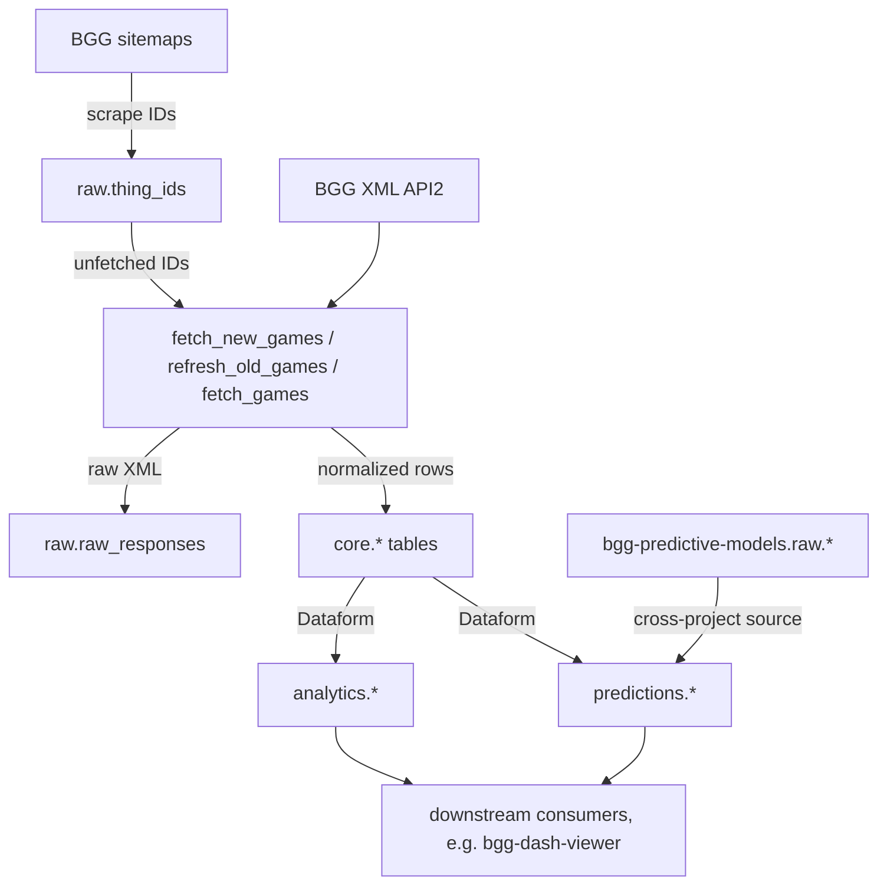

# BGG Data Warehouse Architecture

This document describes how data moves through the warehouse. For the top-level
summary see the [README](../README.md); for visuals see the diagrams under
[architecture/diagrams/](architecture/diagrams/) (`01-ecosystem-overview`,
`02-data-warehouse-internals`, `03-predictive-models-internals`,
`04-dash-viewer-internals`).

## Pipeline stages

The pipeline is a set of small Python entry points under `src/pipeline/`, each run
as a Cloud Run job (and runnable locally with `uv run python -m src.pipeline.<name>`).

### 1. ID discovery — `fetch_thing_ids`

Discovers new game IDs by scraping BGG's sitemap index and per-type sitemaps
(`boardgame`, `boardgameexpansion`, `boardgameaccessory`). BGG serves these behind
Cloudflare, so the scrape drives a real (stealth) browser via Playwright rather than
plain HTTP. New IDs are MERGEd into `raw.thing_ids` (idempotent — a re-run or
catch-up is safe).

Because Cloudflare blocks datacenter egress, the **scheduled** scrape runs
off-platform on a residential-IP "home box" (see [scripts/box/README.md](../scripts/box/README.md)),
which fires a `thing_ids_fetched` `repository_dispatch` on success. The
`fetch_thing_ids.yml` GitHub Actions workflow remains as a manual fallback.

### 2. Fetch — `fetch_new_games` / `fetch_games` / `refresh_old_games`

These fetch game data from BGG's public [XML API2](bgg_api.md) and store the raw XML
in `raw.raw_responses`, then process it into the normalized `core` tables in the same
run. The `src/api_client` module handles rate limiting (~2 req/s) and retries; the
`src/data_processor` module parses XML into rows.

- **`fetch_new_games`** — fetches every unfetched ID in `raw.thing_ids`. Triggered by
  the home box's `thing_ids_fetched` dispatch.
- **`refresh_old_games`** — re-fetches games whose data is stale under the
  publication-year policy in `config/bigquery.yaml` (recent games weekly → vintage
  bi-annually). Scheduled daily at 07:00 UTC.
- **`fetch_games`** — on-demand fetch/refresh of a specific set of IDs (from the
  `GAME_IDS` env var / the `fetch_games.yml` `game_ids` input).

### 3. Transform — Dataform

[Dataform](https://cloud.google.com/dataform) models in `definitions/*.sqlx` build the
`analytics` and `predictions` datasets from `core` (and from cross-project ML sources).
Runs via the `dataform.yml` workflow after any fetch/refresh. See
[dataform_operations.md](dataform_operations.md) for incremental-refresh and schema-drift
guidance, and [lineage.md](lineage.md) for the model graph.

### 4. Enrich — `bgg-predictive-models`

The sibling [`bgg-predictive-models`](https://github.com/phenrickson/bgg-predictive-models)
project scores complexity, ratings, and embeddings. Its outputs land in
`bgg-predictive-models.raw.*` and are pulled into this warehouse's `predictions`
dataset as cross-project Dataform sources (declared in `definitions/sources.js`).
The two repos coordinate with a bidirectional `repository_dispatch` handshake (below).

## Data flow

## Event chain (orchestration)

Rather than a fixed schedule, the daily run is event-driven via `repository_dispatch`:

1. Home box (~06:00 UTC) → `thing_ids_fetched` → **Run Fetch New Games**.
2. Fetch/refresh completion → (via `workflow_run`) **Run Dataform** → publishes
   `analytics` + `predictions`.
3. Dataform success → `dataform_complete` dispatch → `bgg-predictive-models` begins
   scoring.
4. As the ML repo finishes each stage it dispatches back — `complexity_complete`,
   `text_embeddings_complete`, `embeddings_complete` — each re-running Dataform to
   publish the new outputs. `embeddings_complete` is the end of the cycle.
5. **Scrape Heartbeat** (12:00 UTC) fails if no home-box dispatch has landed in ~26h.

## Datasets

| Dataset | Owner | Purpose |
|---------|-------|---------|
| `raw` | pipeline | landed XML + fetch/processing tracking (`thing_ids`, `raw_responses`, `fetched_responses`, `processed_responses`, `request_log`, `fetch_in_progress`) |
| `core` | pipeline | normalized games + dimension/creator/association tables |
| `analytics` | Dataform | consumer-facing views/tables (`games_active`, `games_features`, `filter_*`, …) |
| `predictions` | Dataform | ML predictions & embeddings from `bgg-predictive-models` |
| `staging`, `monitoring` | Dataform | internal (feature-change hashes, deployed-model registry) |

See `config/bigquery.yaml` for the raw/core schemas and the refresh policy.

## Infrastructure

- **Cloud Run jobs** (built & deployed by Cloud Build via `config/cloudbuild.yaml`):
  `bgg-fetch-thing-ids`, `bgg-fetch-new-games`, `bgg-refresh-old-games`, `bgg-fetch-games`.
- **Terraform** (`terraform/`) manages the artifact registry, service accounts, and
  Secret Manager — not the Cloud Run jobs.

## Consumers

The warehouse has no UI of its own. The `analytics` and `predictions` datasets are
read by downstream apps — notably the separate
[`bgg-dash-viewer`](https://github.com/phenrickson/bgg-dash-viewer) project (see
`architecture/diagrams/01-ecosystem-overview` and `04-dash-viewer-internals`).
