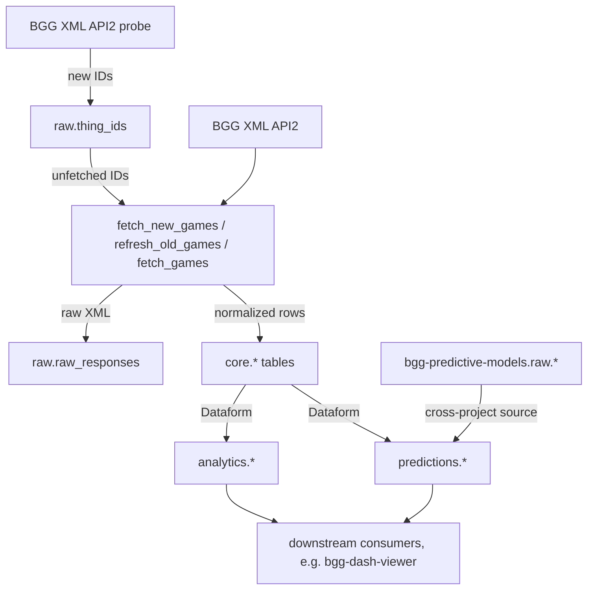

# BGG Data Warehouse Architecture

This document describes how data moves through the warehouse. For the top-level
summary see the [README](../README.md); for visuals see the diagrams under
[architecture/diagrams/](architecture/diagrams/) (`01-ecosystem-overview`,
`02-data-warehouse-internals`, `03-predictive-models-internals`,
`04-dash-viewer-internals`).

## Pipeline stages

The pipeline is a set of small Python entry points under `src/pipeline/`, each run
as a Cloud Run job (and runnable locally with `uv run python -m src.pipeline.<name>`).

### 1. ID discovery — `fetch_thing_ids`

Discovers new game IDs by probing BGG's XML API2 around the current maximum in
`raw.thing_ids` (`--source bgg_api_probe`, the default). BGG allocates an ID on
submission but publishes after approval, so most newly visible IDs sit *below* the
frontier; the probe therefore starts `--lookback N` IDs back, skips IDs already
known, and only counts misses at or above the frontier toward its stop. The
authenticated API is not behind Cloudflare's datacenter block, so this runs on
GitHub Actions at 06:00 UTC — lookback 500 Mon–Sat (new/upcoming games), 5,000 on
Sunday (catch-up). New IDs are MERGEd into `raw.thing_ids` (idempotent — a re-run or
catch-up is safe). Design: [probe lookback spec](superpowers/specs/2026-09-18-id-probe-lookback-design.md).

Sitemap scraping (`--source bgg_sitemap`) is kept as a legacy option. It drives a
stealth Playwright browser and needs residential egress, which is what the
off-platform "home box" (see [scripts/box/README.md](../scripts/box/README.md)) was for;
that path still works via its `thing_ids_fetched` `repository_dispatch`.

### 2. Fetch — `fetch_new_games` / `fetch_games` / `refresh_old_games`

These fetch game data from BGG's public [XML API2](bgg_api.md) and store the raw XML
in `raw.raw_responses`, then process it into the normalized `core` tables in the same
run. The `src/api_client` module handles rate limiting (~2 req/s) and retries; the
`src/data_processor` module parses XML into rows.

- **`fetch_new_games`** — fetches every unfetched ID in `raw.thing_ids`. Runs after
  `fetch_thing_ids` completes.
- **`refresh_old_games`** — re-fetches games whose data is stale under the
  publication-year policy in `config/bigquery.yaml` (recent games weekly → vintage
  bi-annually). Runs after `fetch_new_games` completes, so one Dataform/ML
  cascade per day covers both new and refreshed games.
- **`fetch_games`** — on-demand fetch/refresh of a specific set of IDs (from the
  `GAME_IDS` env var / the `fetch_games.yml` `game_ids` input).

### 3. Transform — Dataform

[Dataform](https://cloud.google.com/dataform) models in `definitions/*.sqlx` build the
`analytics` and `predictions` datasets from `core` (and from cross-project ML sources).
Runs via the `dataform.yml` workflow after any fetch/refresh. See
[dataform_operations.md](dataform_operations.md) for incremental-refresh and schema-drift
guidance, and [lineage.md](lineage.md) for the model graph.

### 4. Enrich — `bgg-predictive-models`

The sibling [`bgg-predictive-models`](https://github.com/phenrickson/bgg-predictive-models)
project scores complexity, ratings, and embeddings. Its outputs land in
`bgg-predictive-models.raw.*` and are pulled into this warehouse's `predictions`
dataset as cross-project Dataform sources (declared in `definitions/sources.js`).
The two repos coordinate with a bidirectional `repository_dispatch` handshake (below).

## Data flow

```mermaid
graph TD
    S[BGG XML API2 probe] -->|new IDs| T[raw.thing_ids]
    T -->|unfetched IDs| F[fetch_new_games / refresh_old_games / fetch_games]
    A[BGG XML API2] --> F
    F -->|raw XML| R[raw.raw_responses]
    F -->|normalized rows| C[core.* tables]
    C -->|Dataform| AN[analytics.*]
    C -->|Dataform| P[predictions.*]
    M[bgg-predictive-models.raw.*] -->|cross-project source| P
    AN --> D[downstream consumers, e.g. bgg-dash-viewer]
    P --> D
```

## Event chain (orchestration)

Rather than a fixed schedule, the daily run is event-driven via `repository_dispatch`:

1. Home box (~06:00 UTC) → `thing_ids_fetched` → **Run Fetch New Games**.
2. `Fetch Thing IDs` → `Run Fetch New Games` → `Run Refresh Old Games` (runs on any
   conclusion of the previous step) → (via `workflow_run`) **Run Dataform** → publishes
   `analytics` + `predictions`. One chain, one cascade per day.
3. Dataform success → `dataform_complete` dispatch → `bgg-predictive-models` begins
   scoring.
4. As the ML repo finishes each stage it dispatches back — `complexity_complete`,
   `text_embeddings_complete`, `embeddings_complete` — each re-running Dataform to
   publish the new outputs. `embeddings_complete` is the end of the cycle.
5. **Scrape Heartbeat** (12:00 UTC) fails if `Run Fetch New Games` hasn't succeeded in ~26h.

## Datasets

| Dataset | Owner | Purpose |
|---------|-------|---------|
| `raw` | pipeline | landed XML + fetch/processing tracking (`thing_ids`, `raw_responses`, `fetched_responses`, `processed_responses`, `request_log`, `fetch_in_progress`) |
| `core` | pipeline | normalized games + dimension/creator/association tables |
| `analytics` | Dataform | consumer-facing views/tables (`games_active`, `games_features`, `filter_*`, …) |
| `predictions` | Dataform | ML predictions & embeddings from `bgg-predictive-models` |
| `staging`, `monitoring` | Dataform | internal (feature-change hashes, deployed-model registry) |

See `config/bigquery.yaml` for the raw/core schemas and the refresh policy.

## Infrastructure

- **Cloud Run jobs** (built & deployed by Cloud Build via `config/cloudbuild.yaml`):
  `bgg-fetch-thing-ids`, `bgg-fetch-new-games`, `bgg-refresh-old-games`, `bgg-fetch-games`.
- **Terraform** (`terraform/`) manages the artifact registry, service accounts, and
  Secret Manager — not the Cloud Run jobs.

## Consumers

The warehouse has no UI of its own. The `analytics` and `predictions` datasets are
read by downstream apps — notably the separate
[`bgg-dash-viewer`](https://github.com/phenrickson/bgg-dash-viewer) project (see
`architecture/diagrams/01-ecosystem-overview` and `04-dash-viewer-internals`).
