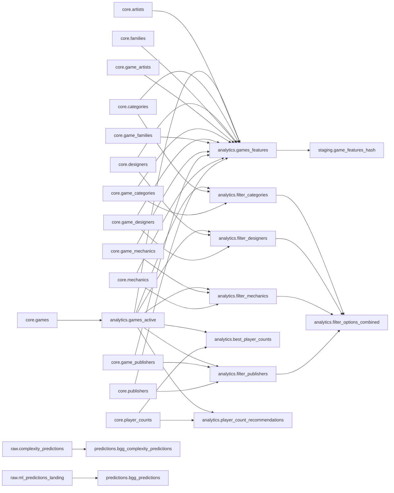
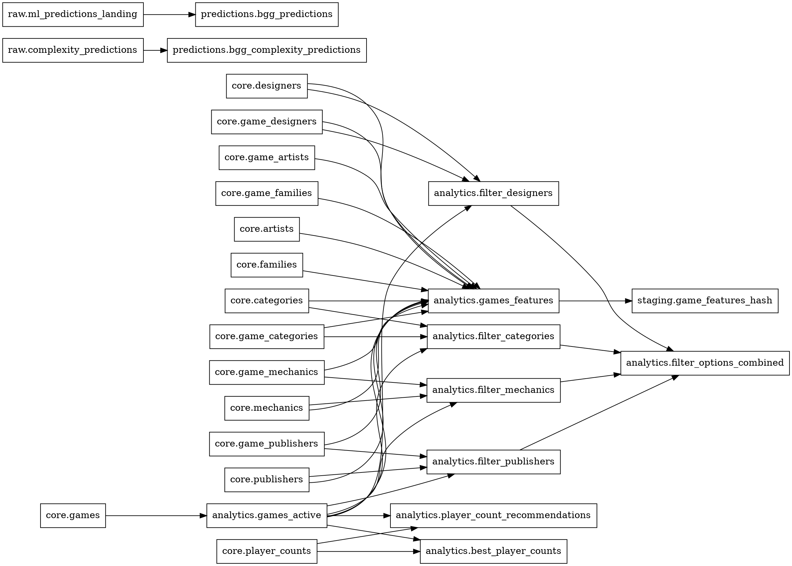

# Dataform Lineage Diagram

```mermaid
graph LR
    analytics__filter_categories["analytics.filter_categories"] --> analytics__filter_options_combined["analytics.filter_options_combined"]
    analytics__filter_designers["analytics.filter_designers"] --> analytics__filter_options_combined["analytics.filter_options_combined"]
    analytics__filter_mechanics["analytics.filter_mechanics"] --> analytics__filter_options_combined["analytics.filter_options_combined"]
    analytics__filter_publishers["analytics.filter_publishers"] --> analytics__filter_options_combined["analytics.filter_options_combined"]
    analytics__games_active["analytics.games_active"] --> analytics__best_player_counts["analytics.best_player_counts"]
    analytics__games_active["analytics.games_active"] --> analytics__filter_categories["analytics.filter_categories"]
    analytics__games_active["analytics.games_active"] --> analytics__filter_designers["analytics.filter_designers"]
    analytics__games_active["analytics.games_active"] --> analytics__filter_mechanics["analytics.filter_mechanics"]
    analytics__games_active["analytics.games_active"] --> analytics__filter_publishers["analytics.filter_publishers"]
    analytics__games_active["analytics.games_active"] --> analytics__games_features["analytics.games_features"]
    analytics__games_active["analytics.games_active"] --> analytics__player_count_recommendations["analytics.player_count_recommendations"]
    analytics__games_features["analytics.games_features"] --> staging__game_features_hash["staging.game_features_hash"]
    core__artists["core.artists"] --> analytics__games_features["analytics.games_features"]
    core__categories["core.categories"] --> analytics__filter_categories["analytics.filter_categories"]
    core__categories["core.categories"] --> analytics__games_features["analytics.games_features"]
    core__designers["core.designers"] --> analytics__filter_designers["analytics.filter_designers"]
    core__designers["core.designers"] --> analytics__games_features["analytics.games_features"]
    core__families["core.families"] --> analytics__games_features["analytics.games_features"]
    core__game_artists["core.game_artists"] --> analytics__games_features["analytics.games_features"]
    core__game_categories["core.game_categories"] --> analytics__filter_categories["analytics.filter_categories"]
    core__game_categories["core.game_categories"] --> analytics__games_features["analytics.games_features"]
    core__game_designers["core.game_designers"] --> analytics__filter_designers["analytics.filter_designers"]
    core__game_designers["core.game_designers"] --> analytics__games_features["analytics.games_features"]
    core__game_families["core.game_families"] --> analytics__games_features["analytics.games_features"]
    core__game_mechanics["core.game_mechanics"] --> analytics__filter_mechanics["analytics.filter_mechanics"]
    core__game_mechanics["core.game_mechanics"] --> analytics__games_features["analytics.games_features"]
    core__game_publishers["core.game_publishers"] --> analytics__filter_publishers["analytics.filter_publishers"]
    core__game_publishers["core.game_publishers"] --> analytics__games_features["analytics.games_features"]
    core__games["core.games"] --> analytics__games_active["analytics.games_active"]
    core__mechanics["core.mechanics"] --> analytics__filter_mechanics["analytics.filter_mechanics"]
    core__mechanics["core.mechanics"] --> analytics__games_features["analytics.games_features"]
    core__player_counts["core.player_counts"] --> analytics__best_player_counts["analytics.best_player_counts"]
    core__player_counts["core.player_counts"] --> analytics__player_count_recommendations["analytics.player_count_recommendations"]
    core__publishers["core.publishers"] --> analytics__filter_publishers["analytics.filter_publishers"]
    core__publishers["core.publishers"] --> analytics__games_features["analytics.games_features"]
    raw__complexity_predictions["raw.complexity_predictions"] --> predictions__bgg_complexity_predictions["predictions.bgg_complexity_predictions"]
    raw__ml_predictions_landing["raw.ml_predictions_landing"] --> predictions__bgg_predictions["predictions.bgg_predictions"]
```

## Graphviz Version

```dot
digraph dataform_lineage {
    rankdir=LR;
    node [shape=box];

    analytics__best_player_counts [label="analytics.best_player_counts"];
    analytics__filter_categories [label="analytics.filter_categories"];
    analytics__filter_designers [label="analytics.filter_designers"];
    analytics__filter_mechanics [label="analytics.filter_mechanics"];
    analytics__filter_options_combined [label="analytics.filter_options_combined"];
    analytics__filter_publishers [label="analytics.filter_publishers"];
    analytics__games_active [label="analytics.games_active"];
    analytics__games_features [label="analytics.games_features"];
    analytics__player_count_recommendations [label="analytics.player_count_recommendations"];
    core__artists [label="core.artists"];
    core__categories [label="core.categories"];
    core__designers [label="core.designers"];
    core__families [label="core.families"];
    core__game_artists [label="core.game_artists"];
    core__game_categories [label="core.game_categories"];
    core__game_designers [label="core.game_designers"];
    core__game_families [label="core.game_families"];
    core__game_mechanics [label="core.game_mechanics"];
    core__game_publishers [label="core.game_publishers"];
    core__games [label="core.games"];
    core__mechanics [label="core.mechanics"];
    core__player_counts [label="core.player_counts"];
    core__publishers [label="core.publishers"];
    predictions__bgg_complexity_predictions [label="predictions.bgg_complexity_predictions"];
    predictions__bgg_predictions [label="predictions.bgg_predictions"];
    raw__complexity_predictions [label="raw.complexity_predictions"];
    raw__ml_predictions_landing [label="raw.ml_predictions_landing"];
    staging__game_features_hash [label="staging.game_features_hash"];

    analytics__filter_categories -> analytics__filter_options_combined;
    analytics__filter_designers -> analytics__filter_options_combined;
    analytics__filter_mechanics -> analytics__filter_options_combined;
    analytics__filter_publishers -> analytics__filter_options_combined;
    analytics__games_active -> analytics__best_player_counts;
    analytics__games_active -> analytics__filter_categories;
    analytics__games_active -> analytics__filter_designers;
    analytics__games_active -> analytics__filter_mechanics;
    analytics__games_active -> analytics__filter_publishers;
    analytics__games_active -> analytics__games_features;
    analytics__games_active -> analytics__player_count_recommendations;
    analytics__games_features -> staging__game_features_hash;
    core__artists -> analytics__games_features;
    core__categories -> analytics__filter_categories;
    core__categories -> analytics__games_features;
    core__designers -> analytics__filter_designers;
    core__designers -> analytics__games_features;
    core__families -> analytics__games_features;
    core__game_artists -> analytics__games_features;
    core__game_categories -> analytics__filter_categories;
    core__game_categories -> analytics__games_features;
    core__game_designers -> analytics__filter_designers;
    core__game_designers -> analytics__games_features;
    core__game_families -> analytics__games_features;
    core__game_mechanics -> analytics__filter_mechanics;
    core__game_mechanics -> analytics__games_features;
    core__game_publishers -> analytics__filter_publishers;
    core__game_publishers -> analytics__games_features;
    core__games -> analytics__games_active;
    core__mechanics -> analytics__filter_mechanics;
    core__mechanics -> analytics__games_features;
    core__player_counts -> analytics__best_player_counts;
    core__player_counts -> analytics__player_count_recommendations;
    core__publishers -> analytics__filter_publishers;
    core__publishers -> analytics__games_features;
    raw__complexity_predictions -> predictions__bgg_complexity_predictions;
    raw__ml_predictions_landing -> predictions__bgg_predictions;
}
```