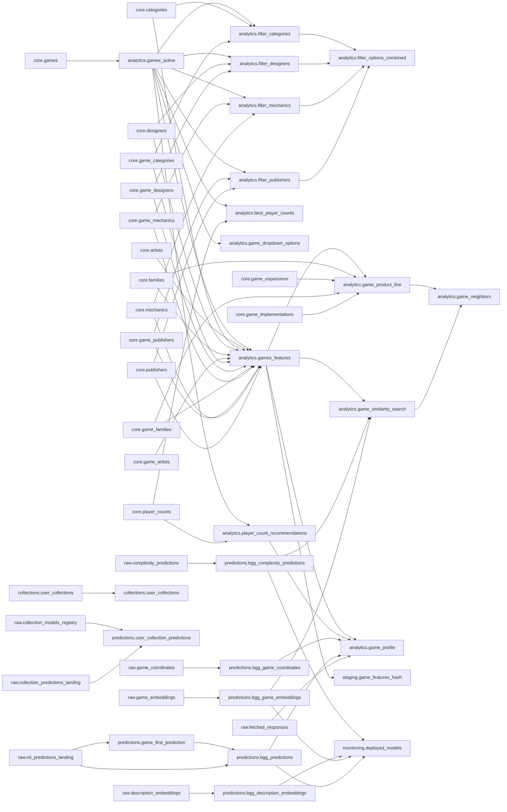

# Dataform Lineage Diagram

```mermaid
graph LR
    bgg_data_warehouse_analytics_filter_categories["analytics.filter_categories"] --> bgg_data_warehouse_analytics_filter_options_combined["analytics.filter_options_combined"]
    bgg_data_warehouse_analytics_filter_designers["analytics.filter_designers"] --> bgg_data_warehouse_analytics_filter_options_combined["analytics.filter_options_combined"]
    bgg_data_warehouse_analytics_filter_mechanics["analytics.filter_mechanics"] --> bgg_data_warehouse_analytics_filter_options_combined["analytics.filter_options_combined"]
    bgg_data_warehouse_analytics_filter_publishers["analytics.filter_publishers"] --> bgg_data_warehouse_analytics_filter_options_combined["analytics.filter_options_combined"]
    bgg_data_warehouse_analytics_game_product_line["analytics.game_product_line"] --> bgg_data_warehouse_analytics_game_neighbors["analytics.game_neighbors"]
    bgg_data_warehouse_analytics_game_similarity_search["analytics.game_similarity_search"] --> bgg_data_warehouse_analytics_game_neighbors["analytics.game_neighbors"]
    bgg_data_warehouse_analytics_games_active["analytics.games_active"] --> bgg_data_warehouse_analytics_best_player_counts["analytics.best_player_counts"]
    bgg_data_warehouse_analytics_games_active["analytics.games_active"] --> bgg_data_warehouse_analytics_filter_categories["analytics.filter_categories"]
    bgg_data_warehouse_analytics_games_active["analytics.games_active"] --> bgg_data_warehouse_analytics_filter_designers["analytics.filter_designers"]
    bgg_data_warehouse_analytics_games_active["analytics.games_active"] --> bgg_data_warehouse_analytics_filter_mechanics["analytics.filter_mechanics"]
    bgg_data_warehouse_analytics_games_active["analytics.games_active"] --> bgg_data_warehouse_analytics_filter_publishers["analytics.filter_publishers"]
    bgg_data_warehouse_analytics_games_active["analytics.games_active"] --> bgg_data_warehouse_analytics_game_dropdown_options["analytics.game_dropdown_options"]
    bgg_data_warehouse_analytics_games_active["analytics.games_active"] --> bgg_data_warehouse_analytics_games_features["analytics.games_features"]
    bgg_data_warehouse_analytics_games_active["analytics.games_active"] --> bgg_data_warehouse_analytics_player_count_recommendations["analytics.player_count_recommendations"]
    bgg_data_warehouse_analytics_games_features["analytics.games_features"] --> bgg_data_warehouse_analytics_game_product_line["analytics.game_product_line"]
    bgg_data_warehouse_analytics_games_features["analytics.games_features"] --> bgg_data_warehouse_analytics_game_profile["analytics.game_profile"]
    bgg_data_warehouse_analytics_games_features["analytics.games_features"] --> bgg_data_warehouse_analytics_game_similarity_search["analytics.game_similarity_search"]
    bgg_data_warehouse_analytics_games_features["analytics.games_features"] --> bgg_data_warehouse_staging_game_features_hash["staging.game_features_hash"]
    bgg_data_warehouse_analytics_player_count_recommendations["analytics.player_count_recommendations"] --> bgg_data_warehouse_analytics_game_profile["analytics.game_profile"]
    bgg_data_warehouse_core_artists["core.artists"] --> bgg_data_warehouse_analytics_games_features["analytics.games_features"]
    bgg_data_warehouse_core_categories["core.categories"] --> bgg_data_warehouse_analytics_filter_categories["analytics.filter_categories"]
    bgg_data_warehouse_core_categories["core.categories"] --> bgg_data_warehouse_analytics_games_features["analytics.games_features"]
    bgg_data_warehouse_core_designers["core.designers"] --> bgg_data_warehouse_analytics_filter_designers["analytics.filter_designers"]
    bgg_data_warehouse_core_designers["core.designers"] --> bgg_data_warehouse_analytics_games_features["analytics.games_features"]
    bgg_data_warehouse_core_families["core.families"] --> bgg_data_warehouse_analytics_game_product_line["analytics.game_product_line"]
    bgg_data_warehouse_core_families["core.families"] --> bgg_data_warehouse_analytics_games_features["analytics.games_features"]
    bgg_data_warehouse_core_game_artists["core.game_artists"] --> bgg_data_warehouse_analytics_games_features["analytics.games_features"]
    bgg_data_warehouse_core_game_categories["core.game_categories"] --> bgg_data_warehouse_analytics_filter_categories["analytics.filter_categories"]
    bgg_data_warehouse_core_game_categories["core.game_categories"] --> bgg_data_warehouse_analytics_games_features["analytics.games_features"]
    bgg_data_warehouse_core_game_designers["core.game_designers"] --> bgg_data_warehouse_analytics_filter_designers["analytics.filter_designers"]
    bgg_data_warehouse_core_game_designers["core.game_designers"] --> bgg_data_warehouse_analytics_games_features["analytics.games_features"]
    bgg_data_warehouse_core_game_expansions["core.game_expansions"] --> bgg_data_warehouse_analytics_game_product_line["analytics.game_product_line"]
    bgg_data_warehouse_core_game_families["core.game_families"] --> bgg_data_warehouse_analytics_game_product_line["analytics.game_product_line"]
    bgg_data_warehouse_core_game_families["core.game_families"] --> bgg_data_warehouse_analytics_games_features["analytics.games_features"]
    bgg_data_warehouse_core_game_implementations["core.game_implementations"] --> bgg_data_warehouse_analytics_game_product_line["analytics.game_product_line"]
    bgg_data_warehouse_core_game_mechanics["core.game_mechanics"] --> bgg_data_warehouse_analytics_filter_mechanics["analytics.filter_mechanics"]
    bgg_data_warehouse_core_game_mechanics["core.game_mechanics"] --> bgg_data_warehouse_analytics_games_features["analytics.games_features"]
    bgg_data_warehouse_core_game_publishers["core.game_publishers"] --> bgg_data_warehouse_analytics_filter_publishers["analytics.filter_publishers"]
    bgg_data_warehouse_core_game_publishers["core.game_publishers"] --> bgg_data_warehouse_analytics_games_features["analytics.games_features"]
    bgg_data_warehouse_core_games["core.games"] --> bgg_data_warehouse_analytics_games_active["analytics.games_active"]
    bgg_data_warehouse_core_mechanics["core.mechanics"] --> bgg_data_warehouse_analytics_filter_mechanics["analytics.filter_mechanics"]
    bgg_data_warehouse_core_mechanics["core.mechanics"] --> bgg_data_warehouse_analytics_games_features["analytics.games_features"]
    bgg_data_warehouse_core_player_counts["core.player_counts"] --> bgg_data_warehouse_analytics_best_player_counts["analytics.best_player_counts"]
    bgg_data_warehouse_core_player_counts["core.player_counts"] --> bgg_data_warehouse_analytics_player_count_recommendations["analytics.player_count_recommendations"]
    bgg_data_warehouse_core_publishers["core.publishers"] --> bgg_data_warehouse_analytics_filter_publishers["analytics.filter_publishers"]
    bgg_data_warehouse_core_publishers["core.publishers"] --> bgg_data_warehouse_analytics_games_features["analytics.games_features"]
    bgg_data_warehouse_predictions_bgg_complexity_predictions["predictions.bgg_complexity_predictions"] --> bgg_data_warehouse_analytics_game_similarity_search["analytics.game_similarity_search"]
    bgg_data_warehouse_predictions_bgg_complexity_predictions["predictions.bgg_complexity_predictions"] --> bgg_data_warehouse_monitoring_deployed_models["monitoring.deployed_models"]
    bgg_data_warehouse_predictions_bgg_description_embeddings["predictions.bgg_description_embeddings"] --> bgg_data_warehouse_monitoring_deployed_models["monitoring.deployed_models"]
    bgg_data_warehouse_predictions_bgg_game_coordinates["predictions.bgg_game_coordinates"] --> bgg_data_warehouse_analytics_game_profile["analytics.game_profile"]
    bgg_data_warehouse_predictions_bgg_game_embeddings["predictions.bgg_game_embeddings"] --> bgg_data_warehouse_analytics_game_similarity_search["analytics.game_similarity_search"]
    bgg_data_warehouse_predictions_bgg_game_embeddings["predictions.bgg_game_embeddings"] --> bgg_data_warehouse_monitoring_deployed_models["monitoring.deployed_models"]
    bgg_data_warehouse_predictions_bgg_predictions["predictions.bgg_predictions"] --> bgg_data_warehouse_analytics_game_profile["analytics.game_profile"]
    bgg_data_warehouse_predictions_bgg_predictions["predictions.bgg_predictions"] --> bgg_data_warehouse_monitoring_deployed_models["monitoring.deployed_models"]
    bgg_data_warehouse_predictions_game_first_prediction["predictions.game_first_prediction"] --> bgg_data_warehouse_predictions_bgg_predictions["predictions.bgg_predictions"]
    bgg_data_warehouse_raw_fetched_responses["raw.fetched_responses"] --> bgg_data_warehouse_analytics_game_profile["analytics.game_profile"]
    bgg_predictive_models_collections_user_collections["collections.user_collections"] --> bgg_data_warehouse_collections_user_collections["collections.user_collections"]
    bgg_predictive_models_raw_collection_models_registry["raw.collection_models_registry"] --> bgg_data_warehouse_predictions_user_collection_predictions["predictions.user_collection_predictions"]
    bgg_predictive_models_raw_collection_predictions_landing["raw.collection_predictions_landing"] --> bgg_data_warehouse_predictions_user_collection_predictions["predictions.user_collection_predictions"]
    bgg_predictive_models_raw_complexity_predictions["raw.complexity_predictions"] --> bgg_data_warehouse_predictions_bgg_complexity_predictions["predictions.bgg_complexity_predictions"]
    bgg_predictive_models_raw_description_embeddings["raw.description_embeddings"] --> bgg_data_warehouse_predictions_bgg_description_embeddings["predictions.bgg_description_embeddings"]
    bgg_predictive_models_raw_game_coordinates["raw.game_coordinates"] --> bgg_data_warehouse_predictions_bgg_game_coordinates["predictions.bgg_game_coordinates"]
    bgg_predictive_models_raw_game_embeddings["raw.game_embeddings"] --> bgg_data_warehouse_predictions_bgg_game_embeddings["predictions.bgg_game_embeddings"]
    bgg_predictive_models_raw_ml_predictions_landing["raw.ml_predictions_landing"] --> bgg_data_warehouse_predictions_bgg_predictions["predictions.bgg_predictions"]
    bgg_predictive_models_raw_ml_predictions_landing["raw.ml_predictions_landing"] --> bgg_data_warehouse_predictions_game_first_prediction["predictions.game_first_prediction"]
```