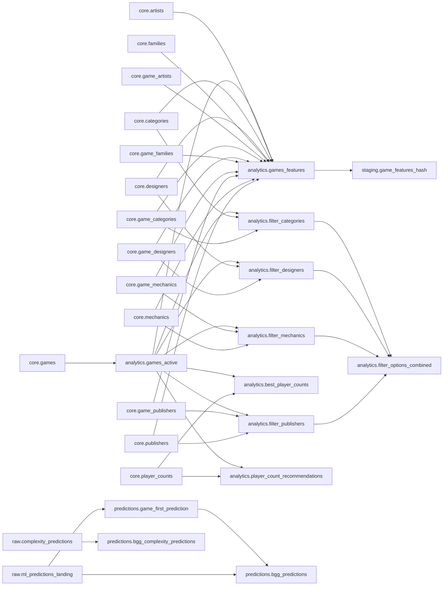

# Dataform Lineage Diagram

```mermaid
graph LR
    analytics__filter_categories["analytics.filter_categories"] --> analytics__filter_options_combined["analytics.filter_options_combined"]
    analytics__filter_designers["analytics.filter_designers"] --> analytics__filter_options_combined["analytics.filter_options_combined"]
    analytics__filter_mechanics["analytics.filter_mechanics"] --> analytics__filter_options_combined["analytics.filter_options_combined"]
    analytics__filter_publishers["analytics.filter_publishers"] --> analytics__filter_options_combined["analytics.filter_options_combined"]
    analytics__games_active["analytics.games_active"] --> analytics__best_player_counts["analytics.best_player_counts"]
    analytics__games_active["analytics.games_active"] --> analytics__filter_categories["analytics.filter_categories"]
    analytics__games_active["analytics.games_active"] --> analytics__filter_designers["analytics.filter_designers"]
    analytics__games_active["analytics.games_active"] --> analytics__filter_mechanics["analytics.filter_mechanics"]
    analytics__games_active["analytics.games_active"] --> analytics__filter_publishers["analytics.filter_publishers"]
    analytics__games_active["analytics.games_active"] --> analytics__games_features["analytics.games_features"]
    analytics__games_active["analytics.games_active"] --> analytics__player_count_recommendations["analytics.player_count_recommendations"]
    analytics__games_features["analytics.games_features"] --> staging__game_features_hash["staging.game_features_hash"]
    core__artists["core.artists"] --> analytics__games_features["analytics.games_features"]
    core__categories["core.categories"] --> analytics__filter_categories["analytics.filter_categories"]
    core__categories["core.categories"] --> analytics__games_features["analytics.games_features"]
    core__designers["core.designers"] --> analytics__filter_designers["analytics.filter_designers"]
    core__designers["core.designers"] --> analytics__games_features["analytics.games_features"]
    core__families["core.families"] --> analytics__games_features["analytics.games_features"]
    core__game_artists["core.game_artists"] --> analytics__games_features["analytics.games_features"]
    core__game_categories["core.game_categories"] --> analytics__filter_categories["analytics.filter_categories"]
    core__game_categories["core.game_categories"] --> analytics__games_features["analytics.games_features"]
    core__game_designers["core.game_designers"] --> analytics__filter_designers["analytics.filter_designers"]
    core__game_designers["core.game_designers"] --> analytics__games_features["analytics.games_features"]
    core__game_families["core.game_families"] --> analytics__games_features["analytics.games_features"]
    core__game_mechanics["core.game_mechanics"] --> analytics__filter_mechanics["analytics.filter_mechanics"]
    core__game_mechanics["core.game_mechanics"] --> analytics__games_features["analytics.games_features"]
    core__game_publishers["core.game_publishers"] --> analytics__filter_publishers["analytics.filter_publishers"]
    core__game_publishers["core.game_publishers"] --> analytics__games_features["analytics.games_features"]
    core__games["core.games"] --> analytics__games_active["analytics.games_active"]
    core__mechanics["core.mechanics"] --> analytics__filter_mechanics["analytics.filter_mechanics"]
    core__mechanics["core.mechanics"] --> analytics__games_features["analytics.games_features"]
    core__player_counts["core.player_counts"] --> analytics__best_player_counts["analytics.best_player_counts"]
    core__player_counts["core.player_counts"] --> analytics__player_count_recommendations["analytics.player_count_recommendations"]
    core__publishers["core.publishers"] --> analytics__filter_publishers["analytics.filter_publishers"]
    core__publishers["core.publishers"] --> analytics__games_features["analytics.games_features"]
    predictions__game_first_prediction["predictions.game_first_prediction"] --> predictions__bgg_predictions["predictions.bgg_predictions"]
    raw__complexity_predictions["raw.complexity_predictions"] --> predictions__bgg_complexity_predictions["predictions.bgg_complexity_predictions"]
    raw__ml_predictions_landing["raw.ml_predictions_landing"] --> predictions__bgg_predictions["predictions.bgg_predictions"]
    raw__ml_predictions_landing["raw.ml_predictions_landing"] --> predictions__game_first_prediction["predictions.game_first_prediction"]
```